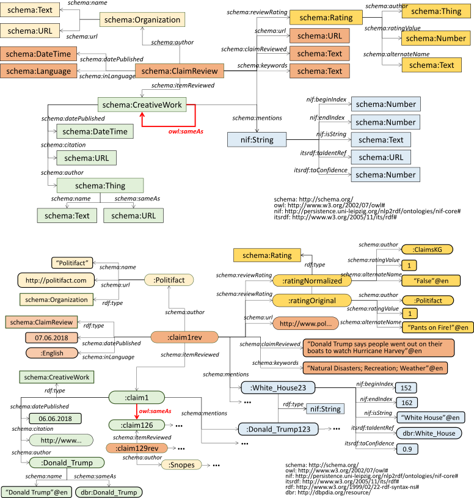

# claimskg_generator
The data lifting module for ClaimsKG that creates the RDF/LOD dataset instantiation from the ClaimsKG model (illustrated hereafter).



### Installation & Requirements

This program requires Python 3.x to run.

To install the dependencies you may use: `pip3 install -r requirements.txt`

### Command-line usage
- For usage information you may use 
```shell
    python3 export.py -h
```
* The options are the following: 
  * `--input [file]` Indicated the location of the zip file generated by the fake new extractor (mandatory)
  * `--output [file]` Specifies the output file for the model (default: out.ttl)
  * `--format [format]` Specifies the format of the output serialization. You may use any of the supported formats in the `rdflib` package (xml', 'n3', 'turtle', 'nt', 'pretty-xml', 'trix', 'trig' and 'nquads'; default: turtle)
  * `--model-uri` The base URI of the model (by default `http://data.gesis.org/claimskg/public/`) 
  * `--resolve` Specifies whether to resolve the Wikipedia page identifiers for TagMe annotations to DBPedia URIs. If this option is activated, the resolution is performed through SPARQL queries to the official DBPedia endpoint, which requires you to have an active Internet connection. Additionally, you will need a running instance of `redis-server` as the results of the queries are cached to prevent unnecessary queries from being performed. If resolve is not supplied, all entities will have URIs of the form `tagme://wikpediaPageID`.
  * `--threshold [float_value]` If `--resolve` is present, specifies the cutoff confidence threshold to include a TagMe annotations as a mention. The TagMe documentation recommends a value between 0.1 and 0.3 (default 0.3)
  * `--include-body` If `--include-body` is supplied, the body of the claim review is included in the `schema:ClaimReview` instances through the `schema:reviewBody` property.
  
  
  ### Claim Matching Evaluation
  In the comtext of the claim matching approach, we have produced a annotated dataset for evaluation purposes. The dataset contains 318 matching claims categorized in several types of matches: 
  - E: Exact match
  - E*: Same claim but different claimee
  - ST: Same topic, meaning that two claims are about the same occurence or event
  
 The first columnt contains the type of match, the second column, the URI of the first claim, the third column, the URI of the second claim. 
 
 The gold file can be downloaded here:
 https://drive.google.com/open?id=1evf67t_p0LqF5ZvNiL-geDCrEBlppZVF
 
 The URIs correspond to that of the following dataset: 
 http://andon.tchechmedjiev.eu/files/claimskg_20_12_2018.ttl.gz
